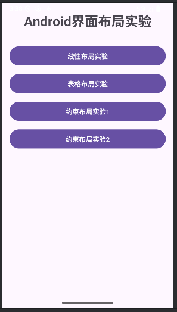
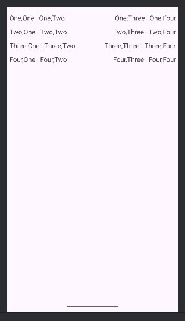
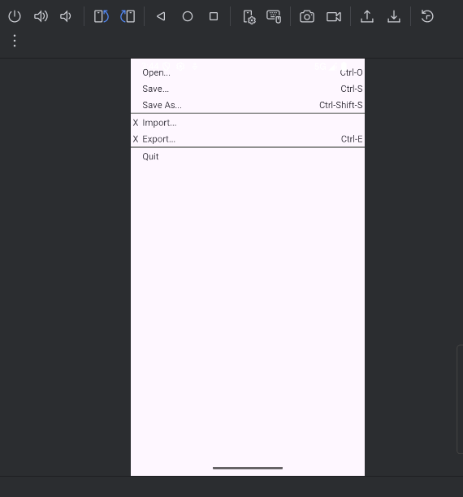
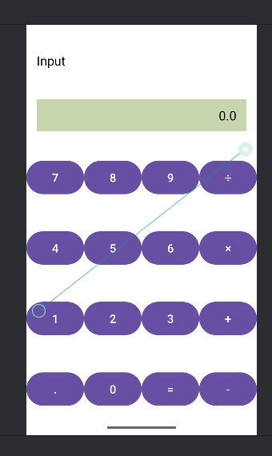
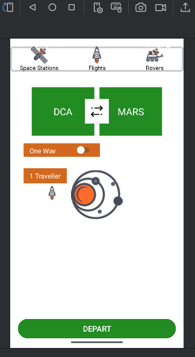

# 实验二：Android界面布局

## 实验目的

- 掌握Android常用布局方式
- 熟练运用LinearLayout、TableLayout、ConstraintLayout
- 能够独立设计并实现不同风格的界面布局

## 实验内容

1. **学习官方布局文档**
    - [Declaring Layout](https://developer.android.google.cn/guide/topics/ui/declaring-layout)
    - [ConstraintLayout教程](https://developer.android.google.cn/training/constraint-layout)

2. **实现四种布局界面**
    - 线性布局（LinearLayout）
    - 表格布局（TableLayout）
    - 约束布局1（ConstraintLayout）
    - 约束布局2（ConstraintLayout）- 使用图片资源

## 实验步骤
### 1. 仔细阅读官方文档，理解各种布局的特性和适用场景

### 2. 初始化界面，添加几个按钮跳转到不同的界面布局示例

   
   主界面包含多个按钮，用于跳转到不同的布局示例界面。

### 3. 按照实验要求分别实现四种布局： 

- 线性布局：
   
   
   **实现要点**：
	- 采用垂直线性布局嵌套四个水平线性布局
	- 合理使用权重(weight)分配空间
	- 设置适当的边距和内边距

- 表格布局：
   
   
   

​	**实现要点**：
​	- 使用gravity属性控制控件对齐方式
​	- 运用layout_alignParentRight等相对定位属性

- 约束布局1：
   
   
   - **约束布局1**：基本约束关系实现

- 约束布局2：
   

	**约束布局2**：结合图片资源实现复杂界面

## 实验结果
完成了四种不同类型的布局实现：
- ✅ 线性布局界面
- ✅ 表格布局界面
- ✅ 约束布局界面1
- ✅ 约束布局界面2（含图片资源）

所有界面均达到实验要求的视觉效果和功能标准。

---

## 实验总结

通过这两个实验的学习和实践，我掌握了：

## 技术能力方面
- Android开发环境的完整搭建流程
- Git版本控制工具的基本使用方法
- Android三种核心布局的设计与实现
- 官方文档阅读和问题解决能力