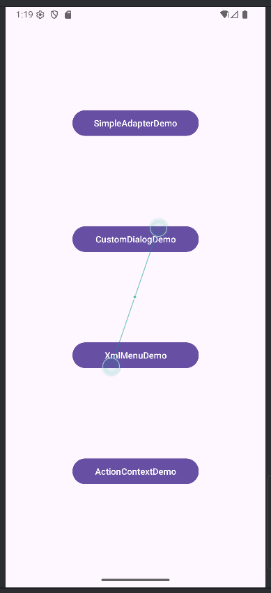
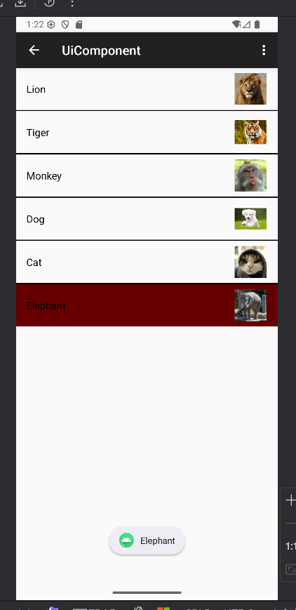
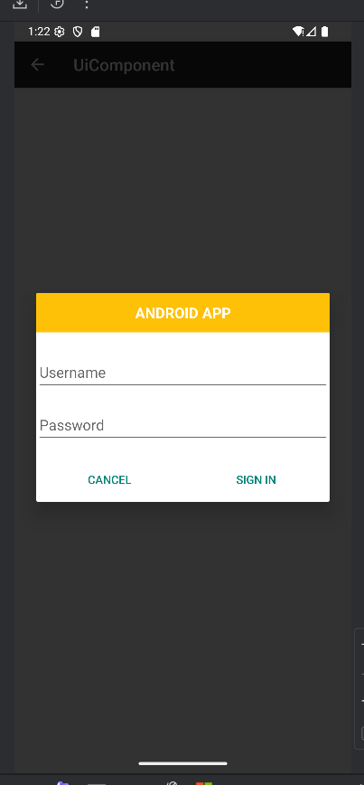
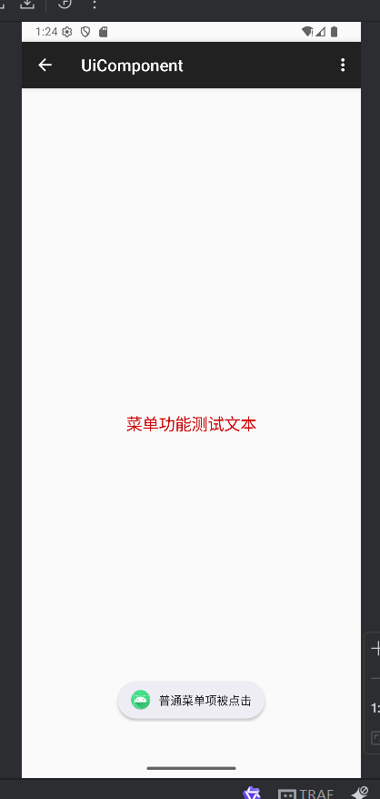
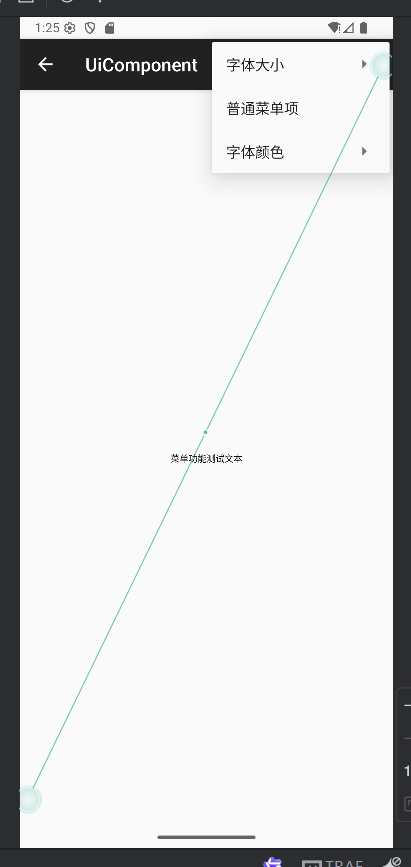
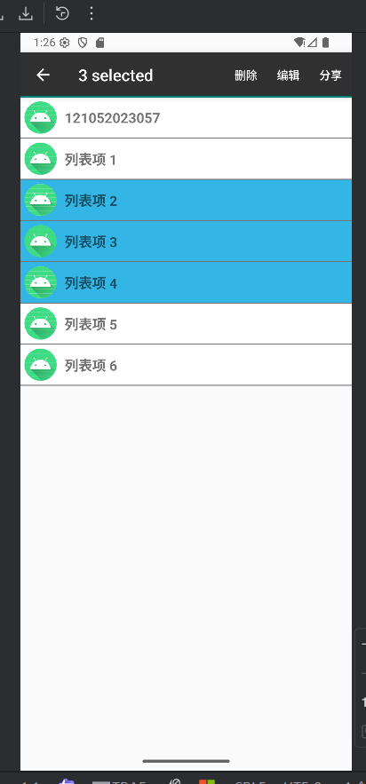

# Android UI组件用法演示

本项目演示了Android平台上几种常用UI组件的实现方式，包括SimpleAdapter、自定义对话框、XML菜单、ActionMode上下文菜单等。通过不同的界面展示了这些组件的具体用法和最佳实践。

## 导航界面

应用主界面包含多个按钮，分别跳转到不同的UI组件演示界面：

- SimpleAdapterDemo - 演示SimpleAdapter的用法
- CustomDialogDemo - 演示自定义对话框的实现
- XmlMenuDemo - 演示如何使用XML文件定义菜单
- ActionContextDemo - 演示ActionMode形式的上下文菜单

  


## 功能演示

### SimpleAdapter用法演示

​		本界面展示了如何使用SimpleAdapter装配ListView，实现图文列表效果。



​	**关键实现**

​		ListView布局定义：

```xml
<ListView
    android:id="@+id/simpleListView"
    android:layout_width="match_parent"
    android:layout_height="wrap_content"
    android:divider="#000"
    android:dividerHeight="2dp"
    android:listSelector="#600"/>
```

​		列表项布局采用ConstraintLayout，包含一个ImageView和一个TextView

```xml
<androidx.constraintlayout.widget.ConstraintLayout xmlns:android="http://schemas.android.com/apk/res/android"
    xmlns:app="http://schemas.android.com/apk/res-auto"
    android:layout_width="match_parent"
    android:layout_height="wrap_content"
    android:padding="8dp">

    <ImageView
        android:id="@+id/imageView"
        android:layout_width="50dp"
        android:layout_height="50dp"
        android:layout_marginEnd="10dp"
        app:layout_constraintEnd_toEndOf="parent"
        app:layout_constraintTop_toTopOf="parent"
        app:layout_constraintBottom_toBottomOf="parent" />

    <TextView
        android:id="@+id/textView"
        android:layout_width="0dp"
        android:layout_height="wrap_content"
        android:textColor="#000"
        android:textSize="16sp"
        app:layout_constraintStart_toStartOf="parent"
        app:layout_constraintEnd_toStartOf="@+id/imageView"
        app:layout_constraintTop_toTopOf="parent"
        app:layout_constraintBottom_toBottomOf="parent" />

</androidx.constraintlayout.widget.ConstraintLayout>
```

### 自定义对话框实现

​		本界面演示了如何创建自定义布局的对话框，实现登录表单等复杂交互。



​	**关键实现**

​		自定义对话框布局：

```xml
<androidx.constraintlayout.widget.ConstraintLayout xmlns:android="http://schemas.android.com/apk/res/android"
    xmlns:app="http://schemas.android.com/apk/res-auto"
    android:layout_width="match_parent"
    android:layout_height="wrap_content">

    <TextView
        android:id="@+id/titleText"
        android:layout_width="0dp"
        android:layout_height="48dp"
        android:background="#FFC107"
        android:gravity="center"
        android:text="@string/android_app"
        android:textColor="#FFFFFF"
        android:textSize="18sp"
        android:textStyle="bold"
        app:layout_constraintEnd_toEndOf="parent"
        app:layout_constraintStart_toStartOf="parent"
        app:layout_constraintTop_toTopOf="parent" />

    <!-- 用户名和密码输入框 -->
    <com.google.android.material.textfield.TextInputLayout
        android:id="@+id/usernameLayout"
        android:layout_width="0dp"
        android:layout_height="wrap_content"
        android:layout_marginTop="16dp"
        app:layout_constraintEnd_toEndOf="parent"
        app:layout_constraintStart_toStartOf="parent"
        app:layout_constraintTop_toBottomOf="@+id/titleText">

        <com.google.android.material.textfield.TextInputEditText
            android:id="@+id/usernameEdit"
            android:layout_width="match_parent"
            android:layout_height="wrap_content"
            android:hint="@string/username"
            android:textColor="@color/grey_600" />

    </com.google.android.material.textfield.TextInputLayout>
    
    <!-- 密码输入框和按钮省略 -->
</androidx.constraintlayout.widget.ConstraintLayout>
```

​		对话框创建代码：

```java
private void showCustomDialog() {
    // 加载自定义布局
    View dialogView = LayoutInflater.from(this).inflate(R.layout.dialog_login, null);
    
    // 创建AlertDialog构建器
    AlertDialog.Builder builder = new AlertDialog.Builder(this);
    builder.setView(dialogView); // 设置自定义布局
    
    // 获取对话框中的按钮
    Button cancelButton = dialogView.findViewById(R.id.cancelButton);
    Button signInButton = dialogView.findViewById(R.id.signInButton);
    
    // 创建对话框
    AlertDialog dialog = builder.create();
    
    // 设置取消按钮点击事件
    cancelButton.setOnClickListener(v -> dialog.dismiss());
    
    // 设置登录按钮点击事件
    signInButton.setOnClickListener(v -> {
        Toast.makeText(AlertDialogActivity.this, "登录按钮被点击", Toast.LENGTH_SHORT).show();
        dialog.dismiss();
    });
    
    // 显示对话框
    dialog.show();
}
```

### 使用XML定义菜单

​		本界面演示了如何通过XML文件定义应用菜单，并在Activity中处理菜单事件。





​	**关键实现**

​		菜单XML定义：

```xml
<menu xmlns:android="http://schemas.android.com/apk/res/android">
    <item
        android:id="@+id/menu_font"
        android:title="@string/menu_font">
        <menu>
            <item
                android:id="@+id/menu_font_small"
                android:title="@string/menu_font_small" />
            <item
                android:id="@+id/menu_font_medium"
                android:title="@string/menu_font_medium" />
            <item
                android:id="@+id/menu_font_large"
                android:title="@string/menu_font_large" />
        </menu>
    </item>
    <item
        android:id="@+id/menu_normal"
        android:title="@string/menu_normal" />
    <item
        android:id="@+id/menu_color"
        android:title="@string/menu_color">
        <menu>
            <item
                android:id="@+id/menu_color_red"
                android:title="@string/menu_color_red" />
            <item
                android:id="@+id/menu_color_black"
                android:title="@string/menu_color_black" />
        </menu>
    </item>
</menu>
```

​		菜单加载与事件处理

```java
@Override
public boolean onCreateOptionsMenu(Menu menu) {
    getMenuInflater().inflate(R.menu.menu_xml_menu, menu);
    return true;
}

@Override
public boolean onOptionsItemSelected(MenuItem item) {
    int id = item.getItemId();
    if (id == android.R.id.home) {
        finish();
        return true;
    }
    if (id == R.id.menu_font_small) {
        testText.setTextSize(10);
        return true;
    } else if (id == R.id.menu_font_medium) {
        testText.setTextSize(16);
        return true;
    } else if (id == R.id.menu_font_large) {
        testText.setTextSize(20);
        return true;
    } else if (id == R.id.menu_normal) {
        Toast.makeText(this, "普通菜单项被点击", Toast.LENGTH_SHORT).show();
        return true;
    } else if (id == R.id.menu_color_red) {
        testText.setTextColor(ContextCompat.getColor(this, android.R.color.holo_red_dark));
        return true;
    } else if (id == R.id.menu_color_black) {
        testText.setTextColor(ContextCompat.getColor(this, android.R.color.black));
        return true;
    }
    return super.onOptionsItemSelected(item);
}
```

### 创建ActionMode模式的上下文菜单

​		本界面演示了如何在ListView中启用批处理上下文操作模式，允许用户选择多个项目并执行操作



​	**关键实现**

​		上下文菜单定义：

```xml
<menu xmlns:android="http://schemas.android.com/apk/res/android"
    xmlns:app="http://schemas.android.com/apk/res-auto">
    <item
        android:id="@+id/action_delete"
        android:title="@string/delete"
        app:showAsAction="always" />
    <item
        android:id="@+id/action_edit"
        android:title="@string/edit"
        app:showAsAction="ifRoom" />
    <item
        android:id="@+id/action_share"
        android:title="@string/share"
        app:showAsAction="ifRoom" />
</menu>
```

​		启用ActionMode上下文菜单：

```
// 设置多选模式
listView.setChoiceMode(ListView.CHOICE_MODE_MULTIPLE_MODAL);
// 设置多选上下文监听器
listView.setMultiChoiceModeListener(new AbsListView.MultiChoiceModeListener() {
    private int selectedCount = 0;
    
    @Override
    public void onItemCheckedStateChanged(android.view.ActionMode mode, int position, long id, boolean checked) {
        if (checked) {
            selectedCount++;
            adapter.setNewSelection(position, true);
        } else {
            selectedCount--;
            adapter.removeSelection(position);
        }
        mode.setTitle(selectedCount + " selected");  // 显示选中数量
    }
    
    @Override
    public boolean onCreateActionMode(android.view.ActionMode mode, Menu menu) {
        mode.getMenuInflater().inflate(R.menu.context_menu, menu);  // 加载上下文菜单
        selectedCount = 0;
        return true;
    }
    
    @Override
    public boolean onActionItemClicked(android.view.ActionMode mode, MenuItem item) {
        int id = item.getItemId();
        if (id == R.id.action_delete) {
            // 批量删除选中项（按倒序删除避免索引错乱）
            Set<Integer> selectedPositions = adapter.getCurrentCheckedPosition();
            List<Integer> positions = new ArrayList<>(selectedPositions);
            Collections.sort(positions, Collections.reverseOrder());
            for (int pos : positions) {
                dataList.remove(pos);
            }
            adapter.notifyDataSetChanged();
            adapter.clearSelection();
            mode.finish();
            return true;
        } else if (id == R.id.action_edit) {
            // 编辑选中项（示例取第一个选中项）
            Set<Integer> selectedPositions = adapter.getCurrentCheckedPosition();
            if (!selectedPositions.isEmpty()) {
                int firstPos = new ArrayList<>(selectedPositions).get(0);
                Toast.makeText(ActionContextMenuActivity.this,
                        "编辑: " + dataList.get(firstPos),
                        Toast.LENGTH_SHORT).show();
            }
            mode.finish();
            return true;
        }
        return false;
    }
    
    // 其他重写方法省略...
});
```

